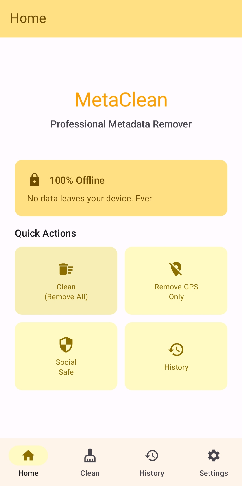
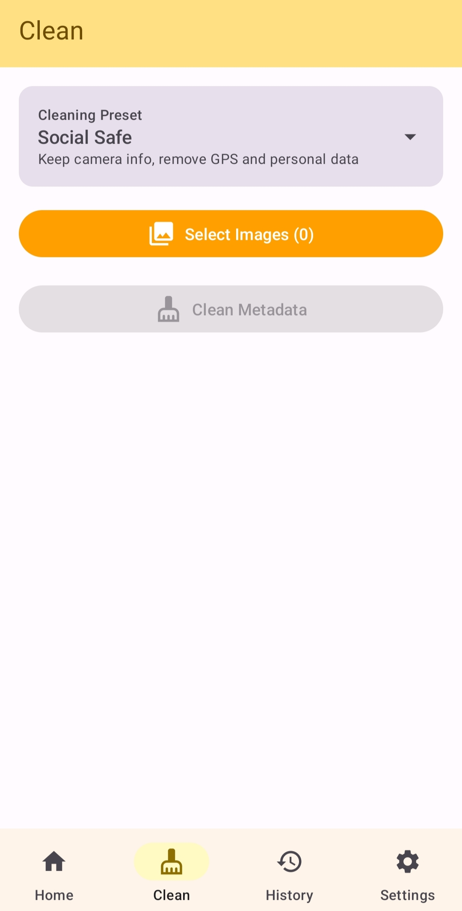
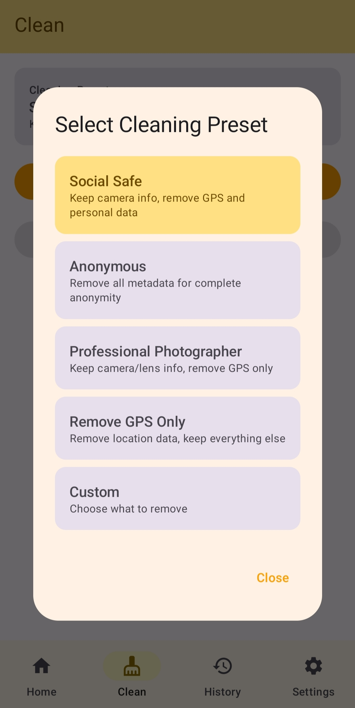
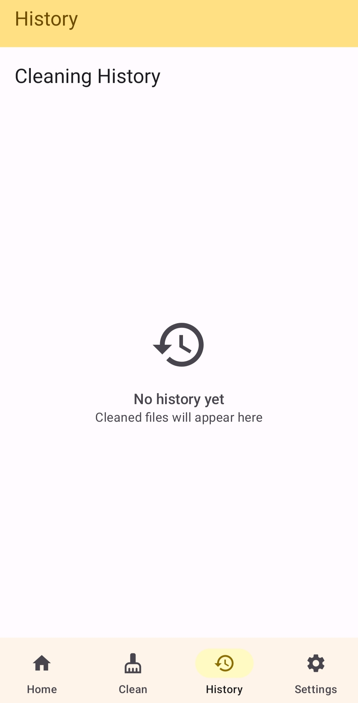
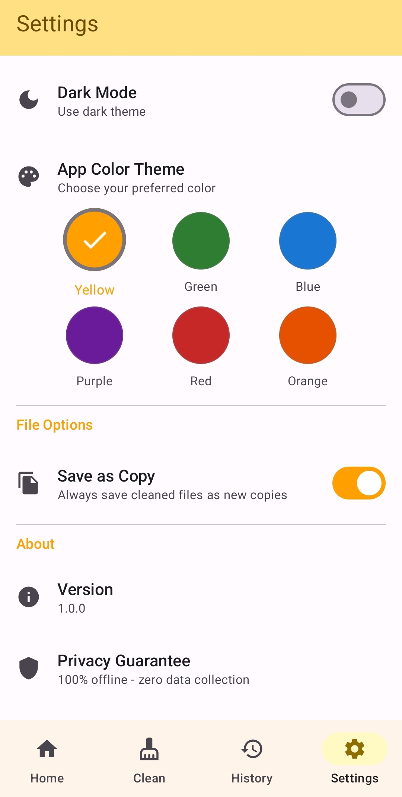

<div align="center">

# 🛡️ MetaClean

### **Your Photos. Your Privacy. No Compromises.**

[](https://opensource.org/licenses/MIT)
[](https://www.android.com/)
[](https://android-arsenal.com/api?level=26)
[](https://github.com/barathvasan-dev/MetaClean)

[Download Latest Release](#-installation) · [Report Bug](https://github.com/barathvasan-dev/MetaClean/issues) · [Request Feature](https://github.com/barathvasan-dev/MetaClean/issues)

</div>

---

## 🚨 The Problem

Every photo you take contains **hidden metadata** that reveals:
- 📍 **Your exact GPS location** (where you live, work, vacation)
- 📅 **Date & time** of every photo
- 📱 **Your phone model** and camera details
- 🏢 **Software you use** (editing apps, OS version)

When you share photos on social media or send them to someone, **you're unknowingly exposing your privacy**. Stalkers, marketers, and data brokers can use this information to track your movements, habits, and personal life.

**The worst part?** Most people don't even know this data exists.

---

## 💡 The Solution

**MetaClean** is a powerful, privacy-first Android app that puts you back in control. Clean metadata from your photos and videos in seconds—before they leave your device.

### Why MetaClean?

✅ **100% Offline** – No internet permission. Zero data collection. Ever.  
✅ **Zero Quality Loss** – Removes metadata without recompressing images  
✅ **Batch Processing** – Clean hundreds of photos at once  
✅ **Smart Presets** – One tap to remove GPS, keep camera info, or go fully anonymous  
✅ **Open Source** – Transparent, auditable, community-driven  

---

## ✨ Features

### 🔐 Privacy & Security
- **App Lock** with biometric authentication (fingerprint/face)
- **No Cloud, No Servers** – Everything stays on your device
- **No Ads, No Tracking** – We never see your photos

### ⚙️ Smarter Cleaning
Choose what to remove:
- 🗺️ **GPS Location** only (keep camera info for professionals)
- 🧹 **Social Safe** (remove personal data, keep camera details)
- 👤 **Anonymous** (strip everything for complete privacy)
- 🎯 **Custom** (you decide what stays and what goes)

### 🎨 Beautiful & Fast
- **Material You Design** – Adaptive colors matching your Android theme
- **6 Color Themes** – Customize the app (Yellow, Green, Blue, Purple, Red, Orange)
- **Batch Processing** – Clean multiple files with one tap
- **History & Undo** – Track what you've cleaned and reverse if needed

### 🚀 Advanced
- **RAW & HEIC Support** – DNG, CR2, HEIC formats
- **Video Metadata** – MP4, MOV support
- **Share Sheet Integration** – Clean directly from Gallery, Files, or any app
- **Before/After Compare** – See exactly what metadata was removed

---
## 📱 Screenshots

<div align="center">

  

 

*Home Screen • Clean Screen • Presets • History • Settings*

</div>


---

## 🔧 Installation

### Option 1: Download APK (Recommended)
1. Go to [Releases](https://github.com/barathvasan-dev/MetaClean/releases)
2. Download `MetaClean-v1.0.apk`
3. Install on your Android device

### Option 2: Build from Source
```bash
git clone https://github.com/barathvasan-dev/MetaClean.git
cd MetaClean
./gradlew assembleRelease
```

The APK will be in `app/build/outputs/apk/release/`

---

## 🚀 Quick Start

1. **Open MetaClean**
2. Tap a **Quick Action**:
   - **Clean (Remove All)** – Strip everything
   - **Remove GPS Only** – Keep camera info
   - **Social Safe** – Ready for Instagram/Twitter
3. **Select photos** from your gallery
4. **Tap "Clean Metadata"**
5. Done! Your photos are now privacy-safe ✨

### Pro Tips
- Use **Share Sheet**: Select photos → Share → MetaClean
- Enable **App Lock** in Settings for extra security
- Check **History** to see what you've cleaned

---

## 🛠️ Tech Stack

**Built with modern Android development:**

- **Language**: Kotlin 100%
- **UI**: Jetpack Compose + Material 3
- **Architecture**: MVVM + Clean Architecture
- **Storage**: DataStore (encrypted preferences)
- **Metadata**: ExifInterface + metadata-extractor
- **Security**: BiometricPrompt API
- **Dependency Injection**: Manual (lightweight)

**Why These Choices?**
- **Compose**: Native, performant, declarative UI
- **MVVM**: Testable, maintainable, scalable
- **Kotlin**: Concise, safe, modern
- **Offline-first**: No network dependencies = faster & more secure

---

## 📖 How It Works

```kotlin
// Simplified workflow
1. User selects photos → CleanScreen
2. Choose preset (GPS_ONLY, SOCIAL_SAFE, ANONYMOUS)
3. MetadataCleaner reads EXIF/IPTC/XMP tags
4. Removes specified metadata fields
5. Saves cleaned photo (no recompression)
6. Logs to HistoryRepository for undo
```

**Key Classes:**
- `MetadataCleaner.kt` – Core metadata removal logic
- `MetadataExtractor.kt` – Reads EXIF/IPTC/XMP data
- `CleaningPreset.kt` – Predefined cleaning profiles
- `HistoryRepository.kt` – Tracks cleaned files

---

## 🤝 Contributing

We ♥ contributions! Whether you're fixing bugs, adding features, or improving docs—every PR matters.

### How to Contribute
1. **Fork** the repo
2. **Create a branch**: `git checkout -b feature/amazing-feature`
3. **Commit changes**: `git commit -m 'Add amazing feature'`
4. **Push**: `git push origin feature/amazing-feature`
5. **Open a Pull Request**

### Development Setup
```bash
# Clone your fork
git clone https://github.com/YOUR_USERNAME/MetaClean.git

# Open in Android Studio
# File → Open → Select MetaClean folder

# Run on device/emulator
./gradlew installDebug
```

**Need Help?** Join [Discussions](https://github.com/barathvasan-dev/MetaClean/discussions) or open an [Issue](https://github.com/barathvasan-dev/MetaClean/issues).

---

## 🙏 Acknowledgments

- [metadata-extractor](https://github.com/drewnoakes/metadata-extractor) – Comprehensive metadata reading
- [ExifInterface](https://developer.android.com/reference/androidx/exifinterface/media/ExifInterface) – Android metadata handling
- [Material Design 3](https://m3.material.io/) – Beautiful UI guidelines
- [Jetpack Compose](https://developer.android.com/jetpack/compose) – Modern Android UI toolkit

---

## 📄 License

```
MIT License

Copyright (c) 2026 MetaClean

Permission is hereby granted, free of charge, to any person obtaining a copy
of this software and associated documentation files (the "Software"), to deal
in the Software without restriction, including without limitation the rights
to use, copy, modify, merge, publish, distribute, sublicense, and/or sell
copies of the Software, and to permit persons to whom the Software is
furnished to do so, subject to the following conditions:

The above copyright notice and this permission notice shall be included in all
copies or substantial portions of the Software.

THE SOFTWARE IS PROVIDED "AS IS", WITHOUT WARRANTY OF ANY KIND, EXPRESS OR
IMPLIED, INCLUDING BUT NOT LIMITED TO THE WARRANTIES OF MERCHANTABILITY,
FITNESS FOR A PARTICULAR PURPOSE AND NONINFRINGEMENT.
```

---

## 🔮 Roadmap

- [ ] **iOS Version** – Bring privacy to iPhone users
- [ ] **Bulk Operations** – Clean entire folders automatically
- [ ] **Cloud Integration** – Optional secure cloud backup (encrypted)
- [ ] **Video Metadata Removal** – Enhanced video support
- [ ] **Fake Metadata Injection** – Add misleading location data (ethical use)
- [ ] **Export Reports** – PDF summaries of cleaned metadata

---

<div align="center">

### 🌟 If MetaClean helps you, consider giving it a star!

**Made with ❤️ by [Barathvasan S](https://github.com/barathvasan-dev)**

[⬆ Back to Top](#-metaclean)

</div>
